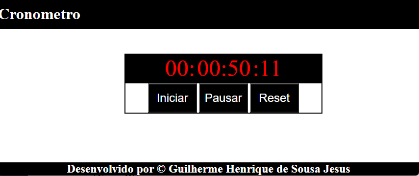

# CronometroJS
Um simples cronômetro desenvolvido em JavaScript.

## Motivo do Projeto
O objetivo deste projeto é criar um aplicativo básico para treinar as habilidades adquiridas em JavaScript.

## Imagem

## Lógica do Cronômetro
O cronômetro funciona somando as variáveis de tempo e incrementando-as a cada segundo. Quando uma variável atinge seu limite (60 para milissegundos, segundos e minutos, e 12 para horas), ela é zerada e a contagem continua.

## Dificuldades
Não foram encontradas muitas dificuldades durante o desenvolvimento, uma vez que o projeto foi criado em JavaScript. A principal escolha foi determinar a melhor função para realizar a soma das variáveis de tempo. Optou-se pelo uso das funções nativas setInterval e clearInterval devido aos seus benefícios e compatibilidade com o projeto.
